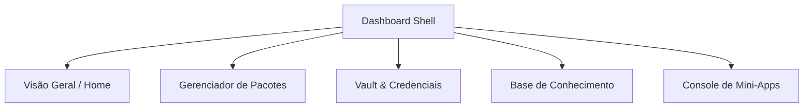

# Blueprint do Cockpit Dashboard (Tailwind CSS)

Este blueprint define a estrutura de páginas, funcionalidades, interface baseada em Tailwind CSS e insights inteligentes para o **Cockpit Dashboard**.

---

## 1. Estrutura de Layout e Design System (Tailwind CSS)

O painel será estruturado seguindo o padrão moderno de Shell de Aplicação Responsivo:

```
┌────────────────────────────────────────────────────────┐
│                        Top Navbar                      │
├───────────┬────────────────────────────────────────────┤
│  Sidebar  │                                            │
│  Nav      │             Main Content Area              │
│  (Fixed/  │             (Grid & Flex Widgets)          │
│  Drawer)  │                                            │
│           │                                            │
└───────────┴────────────────────────────────────────────┘
```

### Classes Tailwind e Convenções Visuais:
*   **Contêiner Principal:** Layout flexível (`flex h-screen overflow-hidden bg-slate-950 text-slate-100`).
*   **Sidebar:** Menu vertical colapsável (`w-64 bg-slate-900 border-r border-slate-800 flex flex-col transition-all duration-300`).
*   **Cards de Widgets:** Efeito de vidro com gradiente sutil (`bg-slate-900/60 backdrop-blur-md border border-slate-800 rounded-xl p-6 hover:border-violet-500/50 transition-all`).
*   **Tipografia:** Família de fontes moderna (Inter/Outfit) com contraste limpo (`text-slate-400` para descrições, `text-white` para títulos).

---

## 2. Mapa de Páginas (Views)

O Cockpit Dashboard contará com 5 visualizações principais estruturadas na sidebar:



### 1. Visão Geral (Overview / Home)
*   **Objetivo:** Painel de controle rápido do estado da máquina.
*   **Componentes:**
    *   *Grid de Status:* 4 cards contendo: Versão do Cockpit, Estado do Vault (Bloqueado/Aberto), Mini-Apps Ativos, Artigos na KB.
    *   *Widget de Diagnóstico:* Interface visual do `cockpit doctor` mostrando avisos ou falhas.
    *   *Ações Rápidas:* Botão para bloquear cofre instantaneamente e botão para rodar diagnóstico.

### 2. Gerenciador de Pacotes (Packages)
*   **Objetivo:** Instalar, atualizar e auditar pacotes locais.
*   **Componentes:**
    *   *Tabs:* "Instalados" e "Registry (Catálogo)".
    *   *Tabela Dinâmica:* Lista com filtros de pesquisa e badges indicando atualizações pendentes.
    *   *Gaveta Lateral (Drawer):* Exibe a lista detalhada de arquivos e dependências ao clicar em um pacote.

### 3. Vault & Credenciais (Security)
*   **Objetivo:** Visualização segura e gerenciamento de chaves.
*   **Componentes:**
    *   *Tela de Bloqueio:* Caso o Vault esteja fechado, exibe apenas um formulário de senha com efeitos visuais e foco automático.
    *   *Lista Mascarada:* Chaves e valores com botão de revelação temporária e cópia rápida para clipboard.
    *   *Editor:* Formulário para inserção segura de novos segredos.

### 4. Base de Conhecimento (Knowledge Base Explorer)
*   **Objetivo:** Buscar notas, gerenciar tags e visualizar conexões.
*   **Componentes:**
    *   *Visualizador de Grafo (Canvas/WebGL):* Rede interativa mapeando o relacionamento entre artigos.
    *   *Lista de Artigos:* Busca rápida fuzzy em títulos e tags.
    *   *Status de Compilação:* Painel mostrando artigos exportados para HTML e erros de build.

### 5. Console de Mini-Apps (Processes)
*   **Objetivo:** Controlar e monitorar os sub-processos do Cockpit.
*   **Componentes:**
    *   *Monitor de Status:* Cards individuais de cada mini-app mostrando consumo estimado, uptime e porta de escuta.
    *   *Botoeira de Controle:* Controles de ciclo de vida (`Start`, `Stop`, `Restart`).
    *   *Log Viewer:* Terminal simulado embutido mostrando logs em tempo real do processo selecionado via WebSocket.

---

## 3. Features Tecnológicas do Dashboard

*   **Paleta de Comandos (Ctrl + K):** Input global flutuante para navegar rapidamente por páginas ou disparar ações (ex: `/vault lock`, `/start app-nome`).
*   **Auto-discovery de Serviços:** Varredura automática das portas locais utilizadas para checagem rápida de integridade dos mini-apps.
*   **Dark & Light Mode Reactivo:** Uso de classes `@media (prefers-color-scheme: dark)` ou controle manual via classe `.dark` injetável no elemento `html`.
*   **Persistência de Sessão Segura:** Autenticação local em memória para manter o Vault aberto por tempo limitado (auto-lock após inatividade).

---

## 4. Insights Inteligentes do Sistema

Para agregar valor além de uma simples UI operacional, o dashboard apresentará análises automáticas:

1.  **Dilema de Notas Órfãs (KB Connections):**
    *   *Insight:* Alerta de notas que não possuem links apontando para elas ou que não apontam para nenhuma nota no grafo de conhecimento.
    *   *Ação:* Sugestão de links com base em similaridade de palavras-chave.
2.  **Consumo e Otimização de Recursos:**
    *   *Insight:* Alerta se algum Mini-App estiver consumindo memória/CPU fora do padrão aceitável para o ambiente de desenvolvimento local.
3.  **Auditorias de Segurança do Vault:**
    *   *Insight:* Identificação de chaves fracas, segredos vazados (mock-up/verificação offline) ou chaves não utilizadas há mais de 90 dias.
4.  **Resolução com Um Clique (Quick-Fix Diagnostics):**
    *   *Insight:* Erros detectados pelo `doctor` são acompanhados por um botão "Resolver". O dashboard executa o comando CLI corretivo por trás dos panos.
