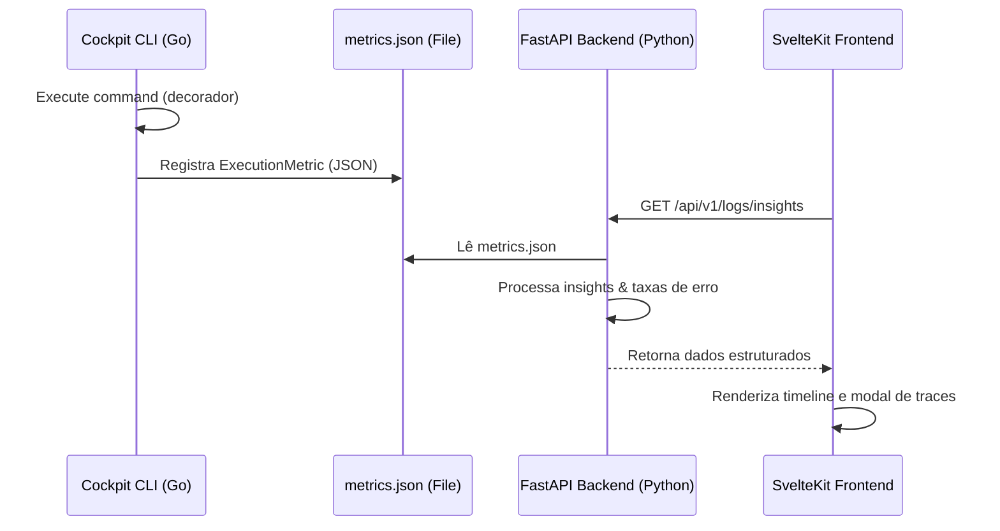

# Dashboard Logs & Insights Architecture

Este documento descreve o funcionamento do sistema de Logs e Insights do Dashboard do Cockpit e sua evolução arquitetural.

## Fluxo de Telemetria

## 1. Coleta de Métricas (CLI)

Todo comando executado no CLI é executado sob o decorator central (`decorateCommands` em [root.go](file:///home/lleite/projects/aicockpit/cmd/root.go)). As métricas são armazenadas de forma persistente em `~/.cockpit/metrics.json`.

Cada registro de execução contém:
- `timestamp`: Momento exato da execução.
- `command`: Nome do comando executado.
- `args`: Argumentos utilizados.
- `status`: `success` ou `error`.
- `exit_code`: Código de saída do processo.
- `duration_ms`: Duração total da execução.
- `user`: Usuário que disparou o comando.
- `error` / `error_type`: Mensagem e classe de exceção, se houver.

## 2. Processamento de Insights (Backend)

O backend em FastAPI no pacote `cockpit-dashboard` lê as métricas brutas e calcula os agregados estatísticos no serviço [log_analyzer.py](file:///home/lleite/projects/cockpit-registry/packages/cockpit-dashboard/app/backend/app/services/log_analyzer.py):

- **Taxas de erro por comando**: `(falhas / execuções) * 100`.
- **Lista de erros recentes**: Top 20 falhas mais recentes ordenadas por timestamp.
- **Insights inteligentes**:
  - Alerta de instabilidade geral se taxa de sucesso for inferior a 95%.
  - Alertas sobre comandos com alta taxa de erro (taxa de erro > 10% em pelo menos 3 execuções).
  - Alertas sobre gargalos de performance (comandos com duração média superior a 1000ms).

## 3. Visualização (Frontend)

O frontend em Svelte 5 ([+page.svelte](file:///home/lleite/projects/cockpit-registry/packages/cockpit-dashboard/app/frontend/src/routes/logs/+page.svelte)) consome os dados e exibe:

- **KPIs**: Cartões responsivos com total de execuções, taxa de sucesso, falhas e duração média.
- **Timeline de Atividade**: Gráfico de barras verticais calculando as alturas com base na proporção diária do pico histórico de execuções. A barra é dividida proporcionalmente entre sucessos (verde) e erros (vermelho), com tooltips customizados no hover.
- **Painel de Insights**: Avisos coloridos (Sucesso, Info, Warning, Error) extraídos dinamicamente do backend.
- **Visualizador de Traces**: Lista detalhada de erros recentes. Ao clicar em "Ver Detalhes", um modal abre com o contexto completo da execução (timestamp, argumentos, exit code, usuário, classe do erro e o stack trace/mensagem completa com botão de cópia rápida).

---

## 4. Integração de KB e Auto-Remediação (Roadmap)

Para a evolução robusta da base de conhecimento, o Dashboard será estendido com três novos fluxos de visualização baseados nas especificações de [llm-wiki-analysis.md](file:///home/lleite/projects/aicockpit/ai-assets/knowledge-base/guides/llm-wiki-analysis.md):

### A. Interface de Resolução de Falhas (Self-Healing UI)
No visualizador de traces de erro, se a falha corresponder a um padrão conhecido na KB de Troubleshooting, o modal exibirá:
1. **Diagnóstico da IA**: Análise simplificada em linguagem natural do porquê o comando falhou.
2. **Solução Recomendada**: O script ou comando corretivo associado.
3. **Botão de Ação "Executar Correção"**: Permite disparar o comando corretivo diretamente pelo backend do dashboard, registrando o resultado de sucesso na KB.

### B. Visualização de Grafo na Aba KB
Adição da aba `/kb` contendo um canvas interativo com o Grafo de Relações da base de conhecimento:
- Permite expandir nós para ver links de entrada e saída.
- Filtros rápidos por tipo (Conceito, Entidade, Logs, Erros).
- Links para edição direta de markdown no painel.

### C. Painel de Integridade de Documentação (Linting)
Exposição de problemas encontrados por `cockpit kb lint`:
- Lista de guias de desenvolvimento órfãos ou desatualizados em relação ao código.
- Botão "Auto-Fix" para delegar o refactoring da documentação obsoleta para o agente de IA de forma autônoma.
