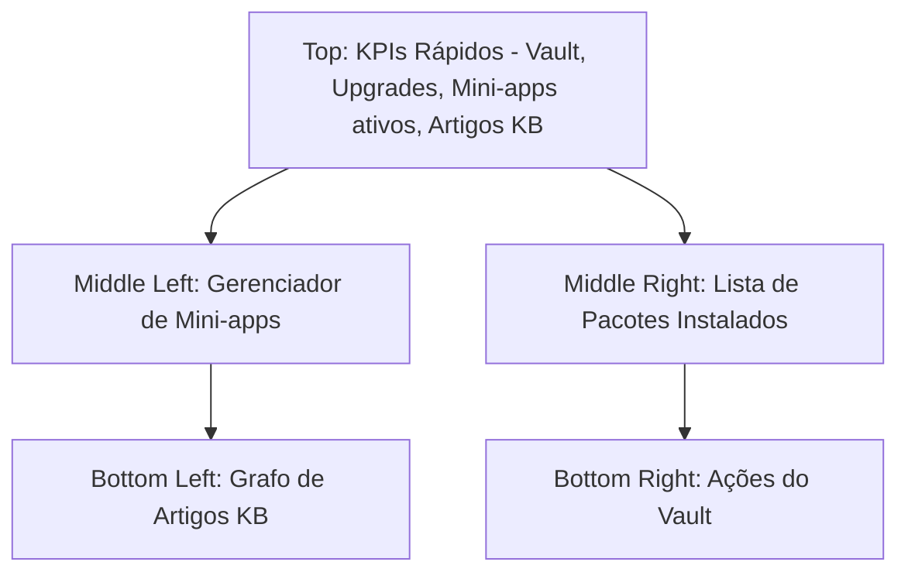

# Guia de Planejamento e Criação de Dashboards: Estudo de Caso Cockpit

Este documento serve como uma base de conhecimento (KB) para orientar o planejamento, design e validação de dashboards eficientes, utilizando o **Cockpit** local como exemplo prático de aplicação.

---

## 1. Princípios de Planejamento e Design (Análise de Referências)

Com base nas melhores práticas de mercado (Coupler.io, LinkedIn, Métricas Boss), um dashboard de alta performance deve seguir quatro pilares fundamentais antes de qualquer linha de código:

### A. Definição da Persona e Objetivo (Quem e Por quê?)
*   **Regra:** Não existe dashboard universal. O painel deve ser focado em um público específico.
*   **No Cockpit:** O usuário principal é o **desenvolvedor local** (operador da máquina). O objetivo é monitorar e gerenciar o estado da ferramenta local de forma rápida e acionável.

### B. Storytelling com Dados e Hierarquia Visual
*   **Regra dos 5 Segundos:** O usuário deve entender a situação geral em 5 segundos.
*   **Padrão de Leitura (F-Pattern):** Elementos cruciais e indicadores agregados (KPIs) devem ficar no topo e no canto superior esquerdo. Informações detalhadas e listas devem ficar no centro e na parte inferior.
*   **Contextualização:** Evitar números soltos. Sempre apresentar o dado com o seu estado correspondente (ex: versão instalada vs. versão disponível no Registry).

### C. Interatividade Sem Sobrecarga
*   **Menos é Mais:** Remover qualquer informação que não gere decisão imediata.
*   **Interações:** Disponibilizar filtros e ações de *drill-down* (detalhamento) e comandos de controle direto (ex: iniciar/parar um mini-app) a partir do próprio painel.

---

## 2. Pontos a Mapear Antes de Iniciar (Pré-requisitos)

Antes de desenhar a interface, é obrigatório mapear a origem e a semântica de cada dado. Para o dashboard do Cockpit, dividimos as entidades da seguinte forma:

| Entidade | Dados Necessários | Ação Esperada pelo Usuário | Frequência de Atualização |
| :--- | :--- | :--- | :--- |
| **Pacotes Instalados** | Nome, versão local, arquivos vinculados, status (atualizado/desatualizado). | Atualizar pacote, desinstalar, ver arquivos. | Sob demanda / Ao iniciar |
| **Registry (Catálogo)**| Pacotes disponíveis, versão mais recente, compatibilidade. | Instalar novo pacote. | Diária / Cache local |
| **Vault (Cofre)** | Status (Bloqueado/Desbloqueado), total de chaves cadastradas. | Bloquear/Desbloquear, gerenciar chaves. | Tempo real / Em memória |
| **Knowledge Base (KB)**| Total de artigos, tags, conexões (grafo), integridade de links. | Criar artigo, buscar, visualizar conexões. | Sob demanda |
| **Mini-Apps** | Status do processo, porta em execução, uso de recursos (CPU/RAM). | Iniciar, parar, reiniciar, abrir no navegador. | Tempo real (Poll de 2-5s) |

---

## 3. Arquitetura da Informação e Wireframe Conceitual

O layout do Cockpit Dashboard é proposto seguindo a hierarquia visual em padrão F:

### Detalhamento dos Componentes

1.  **Header & KPIs Rápidos (Topo):**
    *   **Indicador do Vault:** Um cadeado visual indicando se o Vault está aberto ou fechado.
    *   **Badge de Atualizações:** Contador de pacotes que possuem versões mais recentes no Registry.
    *   **Mini-apps ativos:** Quantidade de mini-apps rodando em background no momento.
2.  **Seção Central (Operacional):**
    *   **Card Esquerdo (Mini-Apps):** Lista de mini-apps com botões de ação rápidos (`Start`, `Stop`, `Restart`) e links diretos para a porta local correspondente (ex: `localhost:8080`).
    *   **Card Direito (Pacotes):** Tabela simplificada mostrando o nome do pacote, versão atual e botão `Upgrade` caso esteja desatualizado.
3.  **Seção Inferior (Conhecimento e Segurança):**
    *   **Grafo/Lista de Artigos:** Resumo da base de conhecimento com busca integrada e métricas de conexões entre notas.
    *   **Vault Control:** Campo para entrada segura de senha para desbloqueio rápido ou bloqueio total imediato.

---

## 4. Checklist Pré-Lançamento (Garantia de Qualidade)

Antes de disponibilizar o dashboard para o usuário final, valide os seguintes pontos:

### A. Confiança e Fidelidade dos Dados
*   [ ] **Paridade CLI/UI:** Os dados exibidos no painel visual correspondem exatamente ao output dos comandos CLI (`cockpit packages list`, `cockpit vault status`, etc.)?
*   [ ] **Tratamento de Offline:** O painel se comporta corretamente se a conexão com o Registry falhar? (Deve exibir os pacotes locais sem travar a interface).
*   [ ] **Erros de Estado:** Elementos exibem estados nulos de forma amigável? (Ex: mini-app parado não deve exibir uso de CPU/RAM como erro, mas sim "0% / Inativo").

### B. Usabilidade e Performance
*   [ ] **Tempo de Resposta:** O carregamento inicial do dashboard (leitura do sistema de arquivos e processos locais) leva menos de 2 segundos?
*   [ ] **Responsividade:** A interface se adapta corretamente a resoluções de telas menores (monitores de notebook vs. telas de monitor ultra-wide)?
*   [ ] **Segurança no Vault:** A senha digitada para desbloquear o Vault não é armazenada em logs, cache do navegador ou variáveis de estado globais não seguras?

### C. Governança e Feedback
*   [ ] **Branding:** A identidade visual segue a paleta do Cockpit.
*   [ ] **Logs de Operação:** Ações executadas na UI (ex: parar mini-app) geram logs claros no console e arquivo de depuração do Cockpit.
