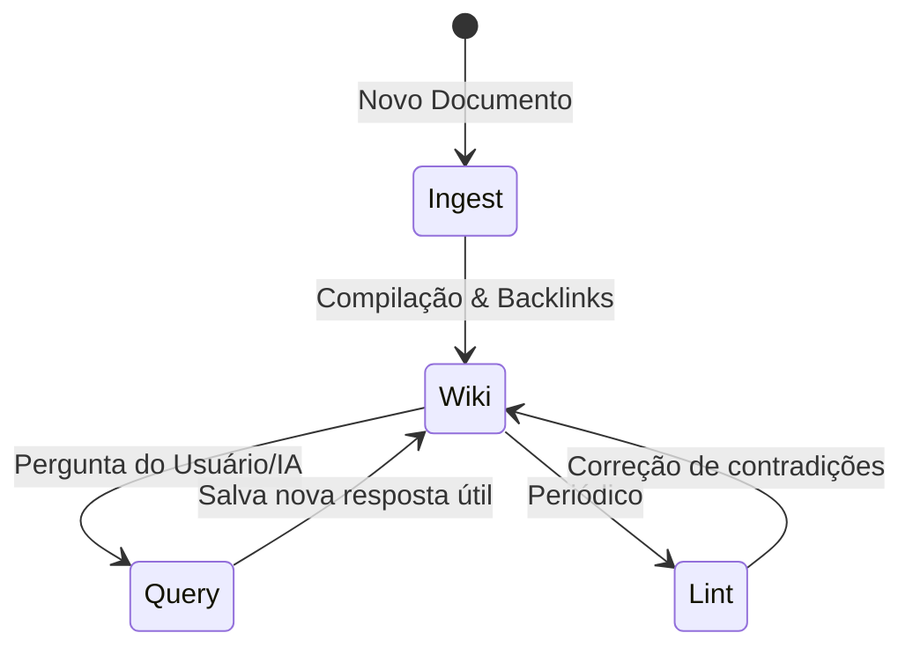

# Análise de Base de Conhecimento Autossustentável (LLM Wiki)

Este documento apresenta uma análise profunda das ideias de Andrej Karpathy sobre **LLM Wikis** (Bases de Conhecimento mantidas por IA) e como esses conceitos podem ser aplicados para tornar a base de conhecimento do **AICockpit** robusta, eficiente e compounding.

---

## 1. O Paradigma: RAG vs. LLM Wiki

A maioria dos sistemas de IA atuais utiliza RAG (Retrieval-Augmented Generation) tradicional, que trata a base de conhecimento de forma passiva. O conceito de LLM Wiki propõe uma mudança radical:

```mermaid
graph TD
    subgraph RAG Tradicional (Stateless)
        A[Pergunta do Usuário] --> B[Busca Vetorial / Embeddings]
        B --> C[Resgate de Chunks Brutos]
        C --> D[LLM Processa Chunks]
        D --> E[Resposta Efêmera]
    end
    
    subgraph LLM Wiki (Compounding & Stateful)
        F[Nova Fonte / Pergunta] --> G[LLM lê e sintetiza]
        G --> H[Atualiza Wiki persistente / .md]
        H --> I[Gera backlinks e atualiza index.md]
        I --> J[Usuário e IA consultam a Wiki compilada]
    end
    
    style E fill:#f9f,stroke:#333,stroke-width:2px
    style J fill:#bbf,stroke:#333,stroke-width:2px
```

### Tabela Comparativa

| Dimensão | RAG Tradicional | LLM Wiki (Karpathy) |
| :--- | :--- | :--- |
| **Estado** | **Stateless**: Cada query começa do zero. | **Stateful**: Conhecimento é acumulado e mantido. |
| **Sintese** | Ocorre em tempo de execução para cada pergunta. | Ocorre no momento da ingestão e manutenção da Wiki. |
| **Consistência** | Pode gerar alucinações por falta de contexto cruzado. | Conflitos e contradições são resolvidos ativamente no ingest/lint. |
| **Custo de Token** | Alto em queries (busca muitos chunks de documentos brutos). | Baixo em queries (busca em páginas estruturadas pré-compiladas). |
| **Manutenção** | Automatizada por pipeline de embedding (caixa preta). | Feita pela IA seguindo instruções de esquema (`CLAUDE.md`). |

---

## 2. A Arquitetura de 3 Camadas

Uma LLM Wiki robusta é dividida em três camadas claras, garantindo separação de responsabilidades:

1. **Fontes Brutas (`raw/`)**: Documentos de origem imutáveis (PDFs, URLs salvas como markdown, artigos). A IA lê desta pasta, mas nunca escreve nela. É a fonte de verdade absoluta.
2. **A Wiki (`wiki/`)**: Arquivos markdown gerados e gerenciados inteiramente pela IA. Inclui conceitos, entidades, logs cronológicos (`log.md`) e um catálogo centralizado (`index.md`).
3. **O Esquema (`CLAUDE.md` / `AGENTS.md`)**: O arquivo de configuração comportamental. Ele dita as regras de nomenclatura, templates de metadados, links e workflows de validação.

> [!IMPORTANT]  
> Sem o **Esquema**, a IA perde a disciplina e a estrutura da Wiki degrada rapidamente a cada nova sessão de chat.

---

## 3. Operações Principais do Ciclo de Vida



- **Ingestion (Ingestão)**: A IA não apenas resume a nova fonte, mas propaga os novos fatos por toda a wiki existente. Uma única página adicionada em `raw/` pode alterar de 10 a 15 páginas na wiki para atualizar referências de conceitos e entidades.
- **Query (Consulta)**: Respostas complexas ou comparações geradas pela IA não morrem no histórico do chat; elas são salvas de volta na wiki como novas páginas de conhecimento, permitindo o enriquecimento contínuo.
- **Lint (Sanitização)**: Verificação de integridade periódica. A IA busca por contradições entre páginas, links quebrados, páginas órfãs e lacunas de informação, propondo novas buscas na web para preencher as lacunas.

---

## 4. O Ecossistema de Implementações da Comunidade

Após a divulgação do gist do Karpathy, a comunidade desenvolveu várias ferramentas que enriquecem o ecossistema:

- **Obsidian**: Utilizado como "IDE" visual da Wiki. O Grafo de Conexões visualiza backlinks gerados pela IA, identificando rapidamente hubs de conhecimento e ilhas órfãs.
- **qmd (Tobi Lütke)**: Um mecanismo de busca local híbrido (BM25 + vetores) de alta performance que roda em linha de comando, permitindo que a IA faça buscas rápidas em wikis muito grandes.
- **Cognee**: Utilizado em implementações como o site [andrej-karpathy.com](https://andrej-karpathy.com) para gerenciar o conhecimento como um grafo cognitivo ativo (Active Graph Memory), permitindo inferências mais complexas além do markdown simples.

---

## 5. Insights de Evolução para o AICockpit

Atualmente, o **AICockpit** possui uma estrutura de KB sob o gerenciador [internal/kb/manager.go](file:///home/lleite/projects/aicockpit/internal/kb/manager.go) utilizando indexação baseada em arquivos e busca por palavra-chave BM25 ([internal/kb/bm25.go](file:///home/lleite/projects/aicockpit/internal/kb/bm25.go)). Para evoluir esta estrutura para uma LLM Wiki robusta, podemos adotar os seguintes aprimoramentos:

### 💡 Proposta de Ações

### A. Integração de Telemetria e Execuções diretamente na KB
> [!TIP]  
> Quando um comando der erro, o dashboard não deve apenas mostrar o log. A IA pode analisar o erro, cruzar com a KB de soluções conhecidas e atualizar a KB automaticamente com a solução aplicada. O conhecimento de debug da IA acumula e se torna persistente.

### B. Ingestão Automatizada de Pacotes e Módulos
Ao instalar um novo pacote (via `cockpit pkg install`), a IA deve processar seu manifesto e documentação na pasta `raw/`, atualizando a wiki local com os comandos expostos, dependências e padrões de uso de forma estruturada.

### C. Implementação do `cockpit kb lint`
Criar um comando CLI nativo para a IA rodar sanitizações na KB:
- Detectar redundâncias em guias de desenvolvimento.
- Encontrar links quebrados entre documentos do repositório.
- Identificar dependências desatualizadas no código analisando a documentação.

### D. Exposição do Grafo de Conexões no Dashboard
Adicionar uma aba "Knowledge Graph" no frontend visual do Cockpit, renderizando visualmente as relações entre pacotes, documentações e ferramentas ativas usando bibliotecas leves de grafos (como D3 ou VisJS).
