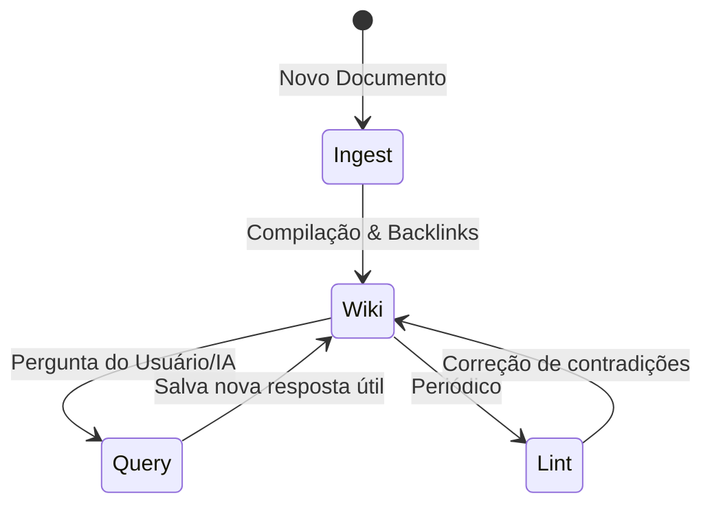
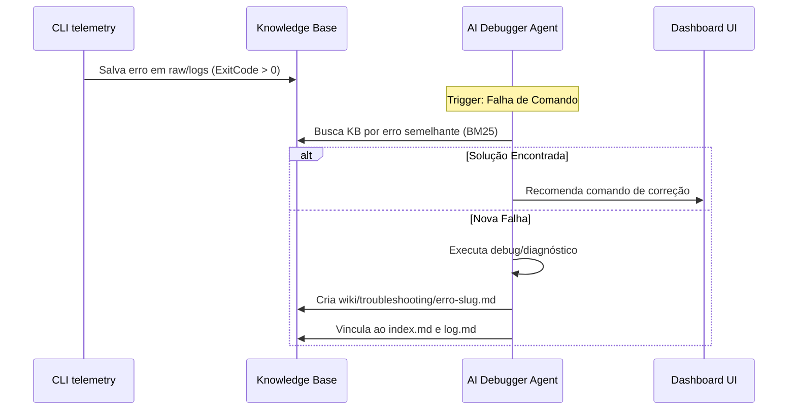

# Análise de Base de Conhecimento Autossustentável (LLM Wiki)

Este documento apresenta uma análise profunda das ideias de Andrej Karpathy sobre **LLM Wikis** (Bases de Conhecimento mantidas por IA) e como esses conceitos podem ser aplicados para tornar a base de conhecimento do **AICockpit** robusta, eficiente e compounding.

---

## 1. O Paradigma: RAG vs. LLM Wiki

A maioria dos sistemas de IA atuais utiliza RAG (Retrieval-Augmented Generation) tradicional, que trata a base de conhecimento de forma passiva. O conceito de LLM Wiki propõe uma mudança radical:

```mermaid
graph TD
    subgraph RAG Tradicional (Stateless)
        A[Pergunta do Usuário] --> B[Busca Vetorial / Embeddings]
        B --> C[Resgate de Chunks Brutos]
        C --> D[LLM Processa Chunks]
        D --> E[Resposta Efêmera]
    end
    
    subgraph LLM Wiki (Compounding & Stateful)
        F[Nova Fonte / Pergunta] --> G[LLM lê e sintetiza]
        G --> H[Atualiza Wiki persistente / .md]
        H --> I[Gera backlinks e atualiza index.md]
        I --> J[Usuário e IA consultam a Wiki compilada]
    end
    
    style E fill:#f9f,stroke:#333,stroke-width:2px
    style J fill:#bbf,stroke:#333,stroke-width:2px
```

### Tabela Comparativa

| Dimensão | RAG Tradicional | LLM Wiki (Karpathy) |
| :--- | :--- | :--- |
| **Estado** | **Stateless**: Cada query começa do zero. | **Stateful**: Conhecimento é acumulado e mantido. |
| **Sintese** | Ocorre em tempo de execução para cada pergunta. | Ocorre no momento da ingestão e manutenção da Wiki. |
| **Consistência** | Pode gerar alucinações por falta de contexto cruzado. | Conflitos e contradições são resolvidos ativamente no ingest/lint. |
| **Custo de Token** | Alto em queries (busca muitos chunks de documentos brutos). | Baixo em queries (busca em páginas estruturadas pré-compiladas). |
| **Manutenção** | Automatizada por pipeline de embedding (caixa preta). | Feita pela IA seguindo instruções de esquema (`CLAUDE.md`). |

---

## 2. A Arquitetura de 3 Camadas

Uma LLM Wiki robusta é dividida em três camadas claras, garantindo separação de responsabilidades:

1. **Fontes Brutas (`raw/`)**: Documentos de origem imutáveis (PDFs, URLs salvas como markdown, artigos). A IA lê desta pasta, mas nunca escreve nela. É a fonte de verdade absoluta.
2. **A Wiki (`wiki/`)**: Arquivos markdown gerados e gerenciados inteiramente pela IA. Inclui conceitos, entidades, logs cronológicos (`log.md`) e um catálogo centralizado (`index.md`).
3. **O Esquema (`CLAUDE.md` / `AGENTS.md`)**: O arquivo de configuração comportamental. Ele dita as regras de nomenclatura, templates de metadados, links e workflows de validação.

> [!IMPORTANT]  
> Sem o **Esquema**, a IA perde a disciplina e a estrutura da Wiki degrada rapidamente a cada nova sessão de chat.

---

## 3. Operações Principais do Ciclo de Vida



- **Ingestion (Ingestão)**: A IA não apenas resume a nova fonte, mas propaga os novos fatos por toda a wiki existente. Uma única página adicionada em `raw/` pode alterar de 10 a 15 páginas na wiki para atualizar referências de conceitos e entidades.
- **Query (Consulta)**: Respostas complexas ou comparações geradas pela IA não morrem no histórico do chat; elas são salvas de volta na wiki como novas páginas de conhecimento, permitindo o enriquecimento contínuo.
- **Lint (Sanitização)**: Verificação de integridade periódica. A IA busca por contradições entre páginas, links quebrados, páginas órfãs e lacunas de informação, propondo novas buscas na web para preencher as lacunas.

---

## 4. O Ecossistema de Implementações da Comunidade

Após a divulgação do gist do Karpathy, a comunidade desenvolveu várias ferramentas que enriquecem o ecossistema:

- **Obsidian**: Utilizado como "IDE" visual da Wiki. O Grafo de Conexões visualiza backlinks gerados pela IA, identificando rapidamente hubs de conhecimento e ilhas órfãs.
- **qmd (Tobi Lütke)**: Um mecanismo de busca local híbrido (BM25 + vetores) de alta performance que roda em linha de comando, permitindo que a IA faça buscas rápidas em wikis muito grandes.
- **Cognee**: Utilizado em implementações como o site [andrej-karpathy.com](https://andrej-karpathy.com) para gerenciar o conhecimento como um grafo cognitivo ativo (Active Graph Memory), permitindo inferências mais complexas além do markdown simples.

---

## 5. Blueprint de Evolução para o AICockpit

Para expandir a base de conhecimento do **AICockpit** ([internal/kb/manager.go](file:///home/lleite/projects/aicockpit/internal/kb/manager.go)) para além de uma busca BM25 simples, propomos quatro especificações detalhadas de features integrando a IA, o CLI e o Dashboard Visual.

---

### FEATURE 1: Ciclo de Auto-Cura de Falhas (Self-Healing Debugging Loop)

O Cockpit monitora comandos que resultaram em erro através do decorator de telemetria. Esta feature transforma erros de execução em conhecimento compounding na KB.



#### Detalhes de Funcionamento
1. **Trigger**: Ao encerrar um comando Cobra com status `error`, o `logging.Manager` salva o stack trace e argumentos na pasta `raw/failures/YYYY-MM-DD-command-slug.json`.
2. **Diagnóstico**: O agente em segundo plano analisa o erro e executa uma busca híbrida na KB. 
3. **Resolução**: Se houver um padrão de correção conhecido (ex: erro de permissão que necessita de `chmod` ou `rtk`), a IA sugere a solução. Se for um erro novo, a IA gera um artigo de "Post-Mortem/Troubleshooting" com a causa raiz e os passos tomados para corrigir.
4. **Dashboards**:
   - Uma seção na tela de logs: **"Correções Sugeridas pela IA"**.
   - Botão **"Auto-Fix"** permitindo o usuário aprovar a execução da correção sugerida diretamente pelo browser.

---

### FEATURE 2: Editor Visual de KB & Visualizador de Grafos interativo

Atualmente a KB é gerenciada via markdown local. Propomos uma interface web no Dashboard que sirva como a "IDE" de conhecimento para o desenvolvedor e para a IA.

#### Detalhes de Funcionamento
1. **Frontend Svelte 5 (Nova rota `/kb`)**:
   - **Tree View**: Visualização da estrutura de diretórios (`wiki/concepts`, `wiki/entities`, `wiki/sources`).
   - **Markdown Editor**: Editor web (ex: Monaco Editor ou simples textarea com preview markdown) permitindo que o desenvolvedor edite os arquivos markdown diretamente no dashboard.
   - **Backlinks e Metadados**: Exibe em uma aba lateral quais arquivos linkam para o documento atual (backlinks) e permite editar campos frontmatter YAML de forma visual.
2. **Visualizador de Grafo Interativo**:
   - Integração de um painel usando D3.js ou Vis.js renderizando os nós da KB.
   - **Código de Cores dos Nós**:
     - *Verde*: Fontes em `raw/`.
     - *Azul*: Conceitos e Entidades em `wiki/`.
     - *Vermelho*: Falhas e Troubleshooting de comandos.
   - Ao clicar em um nó do grafo, a interface redireciona para o editor de markdown daquele documento.

---

### FEATURE 3: Validador Semântico de KB (`cockpit kb lint`)

Feature para garantir a consistência das documentações e código do projeto, impedindo degradações ao longo do tempo.

#### Detalhes de Funcionamento
1. **CLI Command**: `cockpit kb lint`
2. **Regras de Linting**:
   - **Contradições**: IA lê os guias na KB e compara com o código fonte atual (ex: um guia diz que a versão mínima do Go é `1.22`, mas o `go.mod` define `1.26`). O lint reporta essa contradição.
   - **Orphans**: Identifica arquivos `.md` na KB que não possuem nenhum link de entrada (backlink) a partir do `index.md` ou de outros guias.
   - **Stale Docs**: Documentos modificados há mais de 30 dias que referenciam módulos de código que sofreram grandes refatorações recentes (cruzando logs do Git).
3. **Exposição no Dashboard**:
   - Aba **"KB Health"** exibindo o score geral de integridade da base de conhecimento (0 a 100%).
   - Lista de warnings de linting com um botão **"Auto-Refactor"**, onde a IA reescreve ou reorganiza os documentos para sanar os alertas.

---

### FEATURE 4: Engine de Grafo Cognitivo Baseado em SQLite (Cognee Style)

Substitui a indexação de texto plano por uma representação de grafo semântico real, salvando triplas RDF (Sujeito -> Predicado -> Objeto) extraídas dos metadados markdown em um banco de dados local SQLite.

#### Exemplo de Estrutura de Triplas
```json
{
  "subject": "doctor",
  "predicate": "depends_on",
  "object": "metrics.json"
}
```

#### Detalhes de Funcionamento
1. **Extrator de Entidades**: Ao rodar a ingestão, o backend em FastAPI analisa o YAML frontmatter e o texto markdown usando regex/AST e insere as relações em uma tabela SQLite `kb_relations (source, target, relation_type)`.
2. **Busca Avançada**:
   - O endpoint `/api/v1/kb/search` executa consultas combinadas.
   - Permite perguntas complexas como: *"Quais comandos dependem de pacotes que estão com falha de conexão?"* O backend realiza travessia de grafos (joins na tabela SQL) e traz o contexto exato necessário para a IA.
