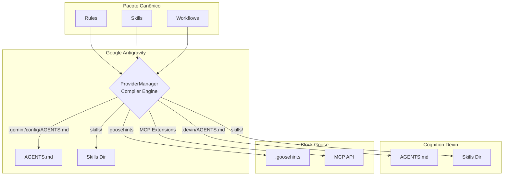

# 02. O Compilador Canônico e Provedores

A pasta `internal/providers` é responsável por integrar o `aicockpit` com os variados agentes de IA do mercado (Devin, Goose, Antigravity, Claude, etc).

## Implementação Canônica (The "Cockpit" Way)

O AICockpit utiliza o conceito de **Representação Canônica**. Isso significa que o desenvolvedor define regras, skills, permissões e fluxos de trabalho *apenas uma vez*, em um formato neutro dentro da pasta `.cockpit/` (ou num pacote). O **Compiler** traduz e implanta esse conteúdo nos formatos nativos exigidos por cada provedor habilitado.

### Matriz de Funcionalidades dos Provedores

| Feature             | Antigravity (Gemini) | Devin (Cognition) | Goose (Block/AI) |
|---------------------|----------------------|-------------------|------------------|
| **Entrypoint**      | `~/.gemini/config/AGENTS.md` | `~/.devin/AGENTS.md` | `~/.config/goose/.goosehints` |
| **Rules**           | `AGENTS.md`          | `AGENTS.md`       | `.goosehints`    |
| **Skills**          | `skills/`            | `skills/`         | *MCP Extensions* |
| **Workflows**       | Subagents            | Linked Plans      | *Not Supported*  |
| **Permissions**     | Handled in CLI/RTK   | `config.yaml`     | *Through RTK*    |
| **Hooks**           | Sim                  | Sim               | Sim              |

## Interface do Compilador

Todo provedor suportado implementa a interface `Compiler` (veja `compiler.go`). 

1. **`CompileEntrypoint()`**: Injeta instruções globais invioláveis (ex: obrigatoriedade do uso do `rtk`).
2. **`CompileRules()`**: Faz o append das regras locais às regras globais da IA.
3. **`CompileSkills()`**: Copia, faz _symlink_ ou adapta os skills canônicos.
4. **`CompilePermissions()`**: Sincroniza configurações de segurança ou *sandboxing*.
5. **`CompileWorkflows()`**: Prepara subagentes ou prompts em cadeia.

## Geração do Ambiente (Deploy)

Quando um pacote é instalado, o `ProviderManager` entra em cena:
1. Ele itera por todos os provedores ativos no `config.yaml`.
2. Para cada um, ele invoca a rotina de compilação.
3. O resultado é um comportamento unificado em todas as IAs (se a sua regra diz para sempre usar testes na linguagem Go, o Devin, o Goose e o Antigravity vão obedecer uniformemente).

> **Próximo Passo:** Entendeu como os provedores digerem o código canônico? Avance para [03. O Sistema de Pacotes](03-package-system.md) para descobrir de onde vêm esses dados canônicos.
