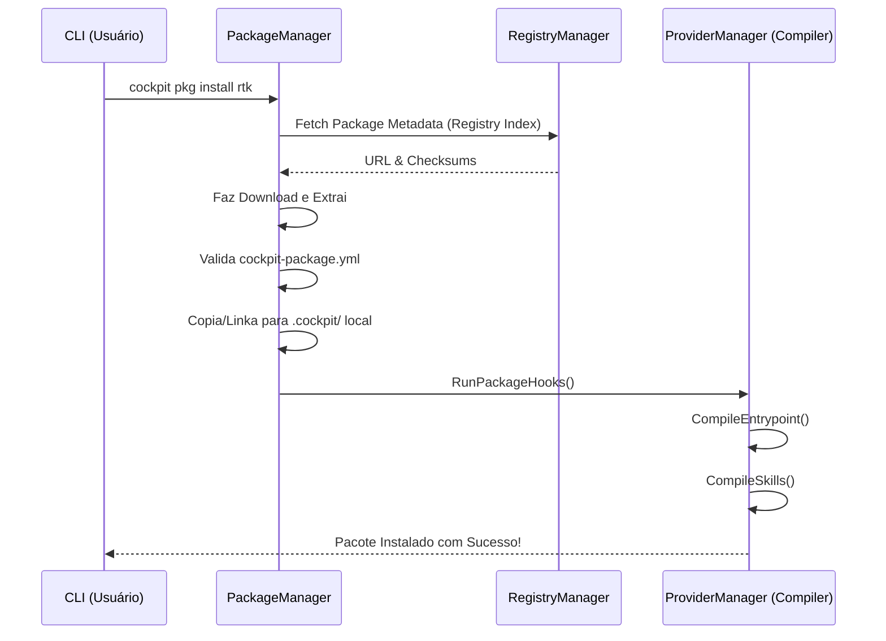

# 03. O Sistema de Pacotes (Packages)

> [!NOTE]
> **Fase de Desenvolvimento:** A arquitetura do Gerenciador e Registro de Pacotes é parte da **Fase 5** do *roadmap*. O design teórico descrito aqui já norteia as implementações, mas os comandos CLI (`cockpit pkg`) estão ativamente em construção.


O `PackageManager` (`internal/packages`) transforma o AICockpit num ecossistema vivo. Pacotes são a unidade fundamental de distribuição de Inteligência, contendo **Skills**, **Hooks**, **Regras** e **Documentação (KB)** acoplados.

## A Anatomia de um Pacote

Um pacote Cockpit é estruturado com base no [Padrão Canônico](../kb/guides/package-specification.md). Ele sempre conta com um arquivo manifesto `cockpit-package.yml`.

Exemplo de pasta de pacote:
```text
meu-pacote/
├── cockpit-package.yml
├── README.md
├── skills/
│   └── rtk-optimizer/
│       └── SKILL.md
└── rules/
    └── GoLang_Lint.md
```

## O Ciclo de Vida da Instalação

A execução de um comando como `cockpit pkg install rtk` desencadeia as seguintes etapas, mapeadas via diagrama:



### 1. Download e Resolução
O Gerenciador de Pacotes busca o pacote através dos **Registries** configurados (discutidos na etapa 04).

### 2. Validação Canônica
Os arquivos contidos no pacote são extraídos e movidos para o cache e a estrutura central do repositório `.cockpit/` (se for um pacote local).

### 3. Acionamento de Hooks
Pacotes podem trazer _scripts_ que executam ações antes ou depois da instalação (ex: instanciar um banco de dados de teste ou baixar um utilitário CLI extra que a IA precisará).

### 4. Compilação Ativa
Após validado, o `PackageManager` notifica o `ProviderManager` para forçar o re-deploy das rotinas de compilação. Isso garante que a IA reconheça a nova *Skill* (como o RTK) imediatamente após o comando terminar.

> **Próximo Passo:** Agora que sabemos como pacotes instalam skills no sistema, como o Cockpit encontra e baixa esses pacotes? Continue para [04. Registros de Pacotes (Registries)](04-package-registries.md).
