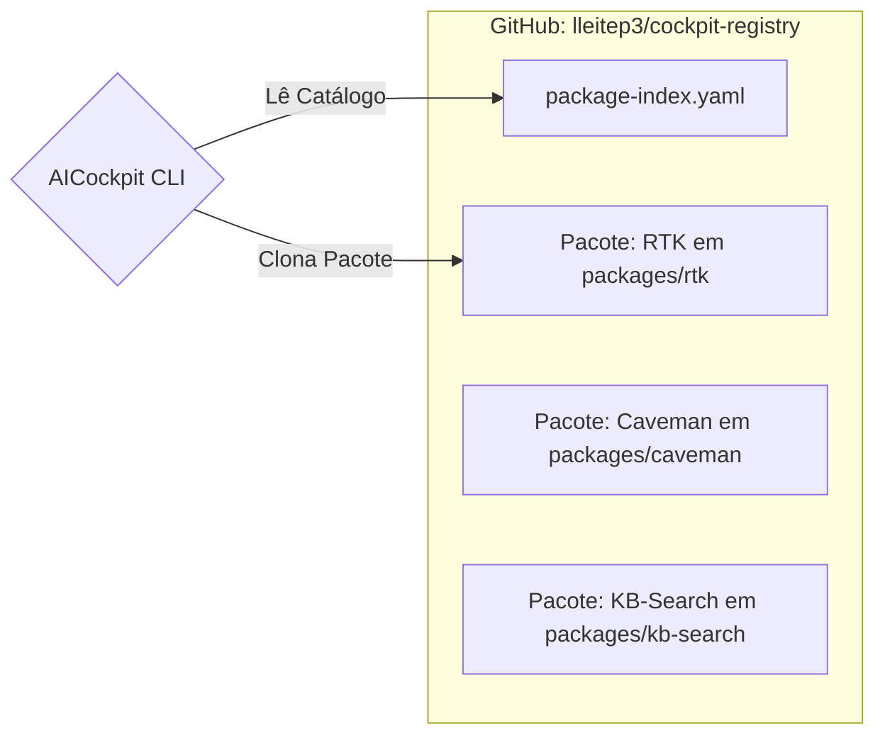

# 04. Registros de Pacotes (Registries)

> [!NOTE]
> **Fase de Desenvolvimento:** A arquitetura do Gerenciador e Registro de Pacotes é parte da **Fase 5** do *roadmap*. O design teórico descrito aqui já norteia as implementações, mas os comandos CLI (`cockpit pkg`) estão ativamente em construção.


Os Registries (Registros) são as fontes de onde o `PackageManager` baixa as bibliotecas de inteligência. Eles são projetados para serem descentralizados, como os PPA do Linux ou os Taps do Homebrew.

## O que é um Registry?

Basicamente, é um repositório Git ou uma URL estática contendo um catálogo central chamado `package-index.yaml` e as pastas contendo os pacotes em si.



### O Arquivo `package-index.yaml`

O coração do registry. Ele possui um formato como:
```yaml
version: "1.0"
name: "official-registry"
packages:
  rtk:
    version: "1.0.0"
    path: "packages/rtk"
    description: "Intercepta e filtra comandos do sistema."
```

## Como o AICockpit lida com eles

As URLs dos registros ficam salvas no `config.yaml` sob a chave `registries`. Por padrão, o repositório oficial é adicionado na instalação do Cockpit.

* **Cache:** O Cockpit clona os registros no diretório de cache do usuário (`~/.cockpit/cache/registries/`).
* **Sincronização:** Comandos como `cockpit pkg update` vão até os registries e dão `git pull`, garantindo que o catálogo de pacotes mais recentes esteja indexado.

## Contribuição e Validação por CI

Todo registry oficial segue um fluxo de contribuição rígido, validado automaticamente por um workflow GitHub Actions (`.github/workflows/validate-packages.yml`):

| Regra | Descrição |
|---|---|
| **Um pacote por PR** | Cada pull request deve adicionar ou modificar exatamente um pacote. |
| **Version bump obrigatório** | Todo PR precisa incrementar a versão no `cockpit-package.yml` do pacote **e** na entrada correspondente do `package-index.yaml`. |
| **Bump condizente com os commits** | `PATCH` para correções, `MINOR` para novas features, `MAJOR` para quebras de compatibilidade. |
| **CI como portão** | O PR só pode ser mergeado após todos os checks de validação passarem. |

Esse design garante rastreabilidade e integridade do catálogo, impedindo que versões desatualizadas ou pacotes sem documentação sejam publicados.

*(Para o guia detalhado prático de como criar os arquivos do repositório e contribuir, veja [Package Registry Setup](../kb/guides/package-registry-setup.md) e [Package Registry](../kb/guides/package-registry.md)).*

## Criando um Registry Privado
Para empresas, a facilidade arquitetural é imensa:
1. Crie um repositório Git isolado na sua VPN corporativa.
2. Adicione as *skills* internas da sua empresa e o `package-index.yaml`.
3. Adicione via CLI: `cockpit pkg registry add corporate https://git.minhaempresa.local/cockpit-registry.git`
4. Seus desenvolvedores e suas IAs começam a importar pacotes com contexto privado!

---
**Fim da Trilha de Arquitetura!**
