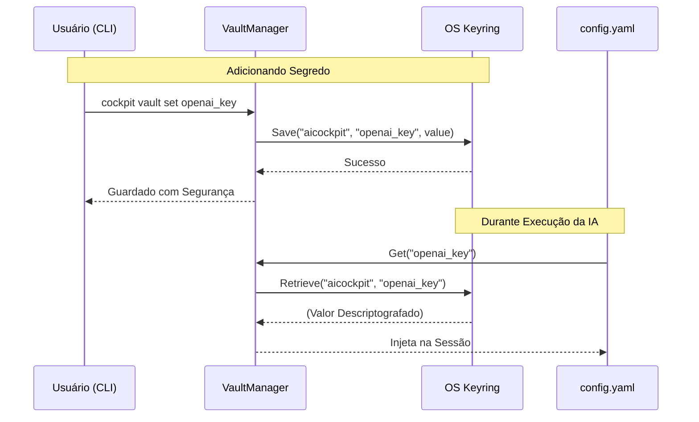

# 05. Sistema de Cofre (Vault System)

> [!NOTE]
> **Fase de Desenvolvimento:** A arquitetura do Sistema de Cofre faz parte da **Fase 5** do *roadmap*. Esta estrutura lida com a segurança nativa de segredos na máquina host.

O `Vault System` (`internal/vault`) é responsável pelo armazenamento seguro de chaves de API, tokens e segredos em geral que o AICockpit e seus Agentes precisam usar (como tokens da OpenAI, GitHub PAT, etc.).

Em vez de armazenar segredos em arquivos de configuração estáticos (`config.yaml`) de forma não segura, o Vault se integra diretamente ao **Gerenciador de Credenciais do Sistema Operacional**.

## Como Funciona

A integração utiliza o ecossistema subjacente de cada SO para garantir criptografia e controle de acesso:

- **macOS:** Keychain Access
- **Windows:** Credential Manager
- **Linux:** Secret Service API / KWallet

## Comandos Principais

O AICockpit expõe a interface do Vault via CLI:
- `cockpit vault set <chave>`: Grava um segredo. A senha será inserida de forma invisível.
- `cockpit vault get <chave>`: Lê e imprime o segredo (útil em automações).
- `cockpit vault remove <chave>`: Exclui a chave do cofre.

## Padrões de Segurança

1. **Namespace Fixo:** O serviço é registrado sob o namespace estrito `aicockpit`, isolando os tokens de outras credenciais do sistema.
2. **Integração sem Eco:** A CLI previne que chaves longas e sensíveis apareçam no terminal durante o momento da inserção.
3. **Mock em CI/CD:** A arquitetura suporta um modo simulado (`keyring.MockInit`) para executar testes automatizados transparentes no GitHub Actions.

> **Próximo Passo:** Entenda como as informações são guardadas e interligadas no AICockpit lendo o [06. Base de Conhecimento (Knowledge Base)](06-knowledge-base.md).
