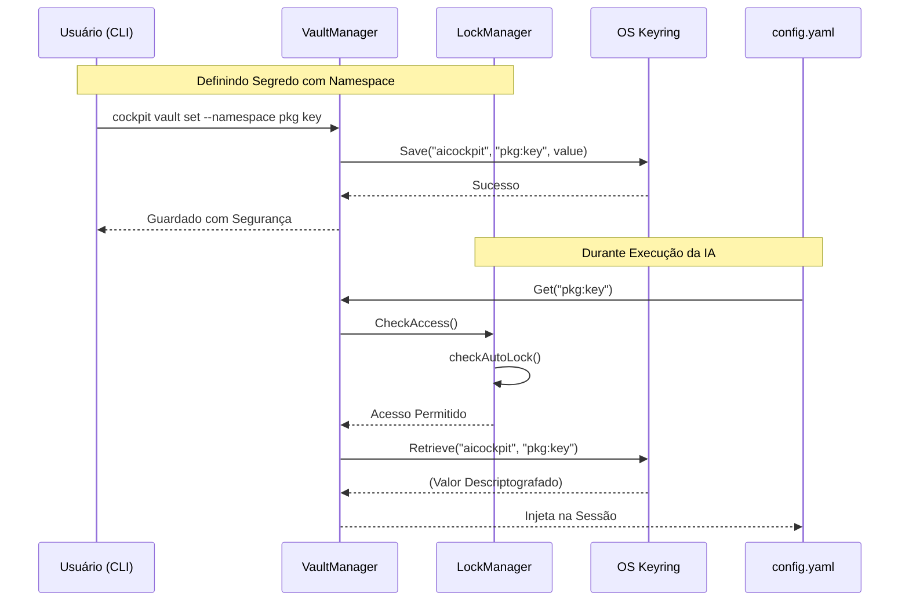

# 05. Sistema de Cofre (Vault System)

> [!NOTE]
> **Fase de Desenvolvimento:** A arquitetura do Sistema de Cofre faz parte da **Fase 5** do *roadmap*. Esta estrutura lida com a segurança nativa de segredos na máquina host.

O `Vault System` (`internal/vault`) é responsável pelo armazenamento seguro de chaves de API, tokens e segredos em geral que o AICockpit e seus Agentes precisam usar (como tokens da OpenAI, GitHub PAT, etc.).

Em vez de armazenar segredos em arquivos de configuração estáticos (`config.yaml`) de forma não segura, o Vault se integra diretamente ao **Gerenciador de Credenciais do Sistema Operacional**, com recursos avançados de segurança incluindo lock/unlock, master password, isolamento de namespace e criptografia de estado.

## Arquitetura

```
┌─────────────────────────────────────────────────────────────────┐
│                        CLI Commands                              │
│  vault set, get, remove, lock, unlock, status, etc.            │
└───────────────────────────┬─────────────────────────────────────┘
                            │
                            ▼
┌─────────────────────────────────────────────────────────────────┐
│                    checkVaultAccess                              │
│  Valida estado de lock antes de operações (sem namespace)       │
└───────────────────────────┬─────────────────────────────────────┘
                            │
                            ▼
┌─────────────────────────────────────────────────────────────────┐
│                    LockManager                                  │
│  - Lock/unlock global e por pacote                             │
│  - Auto-lock com expiração por timestamp                       │
│  - Persistência de estado criptografado (AES-256-GCM)           │
└───────────────────────────┬─────────────────────────────────────┘
                            │
                            ▼
┌─────────────────────────────────────────────────────────────────┐
│                Master Password (Opcional)                        │
│  - Set, change, disable master password                         │
│  - Requerido para lock/unlock (exceto em dev mode)              │
└───────────────────────────┬─────────────────────────────────────┘
                            │
                            ▼
┌─────────────────────────────────────────────────────────────────┐
│              Vault Implementations                               │
│  - NamespacedVault (isolamento de namespace)                    │
│  - OSVault (acesso direto, descontinuado)                       │
│  - VaultService (verificação baseada em processo)                │
└───────────────────────────┬─────────────────────────────────────┘
                            │
                            ▼
┌─────────────────────────────────────────────────────────────────┐
│                  OS Keyring (go-keyring)                         │
│  - macOS: Keychain                                              │
│  - Windows: Credential Manager                                  │
│  - Linux: gnome-keyring / KWallet                               │
└─────────────────────────────────────────────────────────────────┘
```

## Componentes

### 1. LockManager

Gerencia estados de lock do vault com persistência criptografada:

```go
type LockManager struct {
    state        *LockState
    storagePath  string
    mu           sync.RWMutex
    encryptor    *StateEncryptor
}

type LockState struct {
    IsLocked          bool              `json:"is_locked"`
    LockedAt          time.Time         `json:"locked_at,omitempty"`
    LockedBy          string            `json:"locked_by,omitempty"`
    PackageLocks      map[string]bool    `json:"package_locks"`
    GlobalUnlock      bool              `json:"global_unlock"`
    UnlockReason      string            `json:"unlock_reason,omitempty"`
    UnlockTime        time.Time         `json:"unlock_time,omitempty"`
    AutoLockExpireAt  time.Time         `json:"auto_lock_expire_at,omitempty"`
}
```

**Funcionalidades:**
- Lock/unlock global
- Lock/unlock específico por pacote
- Auto-lock com expiração por timestamp
- Persistência de estado criptografado
- Controle de acesso via `CanPackageAccess()`

### 2. Master Password

Master password opcional para segurança adicional:

```go
type MasterPassword struct {
    enabled     bool
    passwordHash string
    storagePath string
}
```

**Funcionalidades:**
- Definir master password (mínimo 8 caracteres)
- Mudar master password (requer senha antiga)
- Desabilitar master password (dev mode)
- Armazenamento criptografado com chave específica do sistema

**Comandos:**
```bash
cockpit vault set-master-password
cockpit vault change-master-password
cockpit vault disable-master-password
```

### 3. Criptografia de Estado

Estado de lock é criptografado com AES-256-GCM e assinado com HMAC-SHA256:

```go
type EncryptedState struct {
    Data      string `json:"data"`
    Signature string `json:"signature"`
    Nonce     string `json:"nonce"`
    Version   string `json:"version"`
    Salt      string `json:"salt"`
}
```

**Recursos de Segurança:**
- Criptografia AES-256-GCM
- Assinatura HMAC-SHA256
- Salt aleatório para derivação de chave
- Detecção de adulteração
- Fallback para defaults seguros se corrompido

### 4. Isolamento de Namespace

NamespacedVault fornece isolamento de segredos por pacote:

```go
type NamespacedVault struct {
    namespace string
    osVault   *osVault
}
```

**Funcionalidades:**
- Prefixo de namespace para todas as chaves
- Acesso cross-namespace bloqueado
- Sanitização automática de namespace
- Detecção de namespace baseada em processo

## Uso

### Gerenciamento Básico de Segredos

```bash
# Definir um segredo
cockpit vault set api-key --value "sk-12345"

# Definir um segredo em um namespace (recomendado)
cockpit vault set --namespace meu-pacote api-key --value "sk-12345"

# Obter um segredo
cockpit vault get api-key

# Obter um segredo de um namespace
cockpit vault get --namespace meu-pacote api-key

# Remover um segredo
cockpit vault remove api-key

# Remover de um namespace
cockpit vault remove --namespace meu-pacote api-key
```

### Operações de Lock/Unlock

```bash
# Bloquear vault globalmente
cockpit vault lock

# Bloquear pacote específico
cockpit vault lock meu-pacote

# Desbloquear vault globalmente
cockpit vault unlock

# Desbloquear pacote específico
cockpit vault unlock meu-pacote

# Desbloquear com auto-lock timeout
cockpit vault unlock --timeout 1h

# Verificar status de lock
cockpit vault status
```

**Nota:** Lock/unlock requer master password (exceto em dev mode).

### Gerenciamento de Master Password

```bash
# Definir master password (interativo)
cockpit vault set-master-password

# Mudar master password (requer senha antiga)
cockpit vault change-master-password

# Desabilitar master password (dev mode, não recomendado)
cockpit vault disable-master-password
```

### Factory Reset

```bash
# Resetar vault - deleta todos os segredos e configurações
cockpit vault factory-reset
```

**Aviso:** Esta ação não pode ser desfeita. Use se esqueceu sua master password.

### Dev Mode

Para automação e testes, use dev mode para pular master password:

```bash
COCKPIT_DEV_MODE=true cockpit vault lock
COCKPIT_DEV_MODE=true cockpit vault unlock
```

## Modelo de Segurança

### Controle de Acesso

1. **Com Namespace (--namespace):**
   - Namespace fornece isolamento
   - Sem verificação de lock necessária
   - Pacotes só podem acessar seus próprios segredos

2. **Sem Namespace:**
   - `checkVaultAccess()` valida estado de lock
   - Requer vault desbloqueado
   - Usa identidade de processo para controle de acesso

### Mecanismo de Auto-Lock

Auto-lock é implementado usando expiração por timestamp:

1. Ao desbloquear com `--timeout 5s`, salva `AutoLockExpireAt = agora + 5s`
2. Em cada acesso via `CanPackageAccess()`, verifica se `agora > AutoLockExpireAt`
3. Se expirado, bloqueia automaticamente o vault
4. Funciona perfeitamente no contexto CLI sem processos de background

### Segurança de Estado

1. **Criptografia:**
   - Estado criptografado com AES-256-GCM
   - Chave derivada de info do sistema + salt aleatório
   - Salt armazenado no estado criptografado

2. **Assinatura:**
   - Assinatura HMAC-SHA256 sobre dados criptografados
   - Derivação de chave baseada em salt previne falsificação
   - Detecta modificações manuais de arquivo

3. **Fallback:**
   - Se verificação de assinatura falha, usa defaults seguros (locked)
   - Previne bypass via adulteração de arquivo

## Estrutura de Arquivos

```
~/.cockpit/vault/
├── lock_state.json          # Estado de lock criptografado
└── master_password.dat      # Master password criptografada
```

Ambos arquivos são criptografados com chaves específicas do sistema e não podem ser modificados manualmente sem detecção.

## Testes

Execute testes do vault:

```bash
# Executar todos os testes do vault
go test ./internal/vault/...

# Executar teste específico
go test ./internal/vault/ -run TestNamespacedVault
```

## Exemplos

Veja o diretório `examples/` para exemplos completos:

- `examples/basic/vault_example.go` - Uso básico do vault
- `examples/demos/vault-lock/main.go` - Demo de lock/unlock
- `examples/demos/vault-service/main.go` - Demo de vault service
- `examples/demos/namespaced/main.go` - Demo de isolamento de namespace

## Considerações de Segurança

1. **Master Password:**
   - Opcional mas recomendado para produção
   - Mínimo 8 caracteres
   - Hashed com SHA-256 antes do armazenamento
   - Criptografado com chave específica do sistema

2. **Isolamento de Namespace:**
   - Use `--namespace` para todos os segredos de pacotes
   - Previne acesso cross-pacote
   - Bypassa verificações de lock (namespace fornece isolamento)

3. **Auto-Lock:**
   - Use `--timeout` para acesso temporário
   - Bloqueia automaticamente após expiração
   - Verificado em cada tentativa de acesso

4. **Criptografia de Estado:**
   - Não pode ser modificado manualmente sem detecção
   - Fallback para defaults seguros se corrompido
   - Usa criptografia padrão da indústria

## Como Funciona

A integração utiliza o ecossistema subjacente de cada SO para garantir criptografia e controle de acesso:

- **macOS:** Keychain Access
- **Windows:** Credential Manager
- **Linux:** Secret Service API / KWallet



## Padrões de Segurança

1. **Namespace Fixo:** O serviço é registrado sob o namespace estrito `aicockpit`, isolando os tokens de outras credenciais do sistema.
2. **Integração sem Eco:** A CLI previne que chaves longas e sensíveis apareçam no terminal durante o momento da inserção.
3. **Mock em CI/CD:** A arquitetura suporta um modo simulado (`keyring.MockInit`) para executar testes automatizados transparentes no GitHub Actions.
4. **Validação de Input:** O sistema valida que valores vazios não são aceitos, evitando armazenamento incorreto.
5. **Tratamento de Erros:** Erros são encapsulados com informações contextuais sem vazar dados sensíveis.
6. **Lock por Padrão:** O vault inicia locked por segurança, requerendo unlock explícito.
7. **Criptografia de Estado:** Estado de lock é criptografado e assinado para prevenir adulteração.
8. **Auto-Lock:** Timeout automático previne acesso não autorizado após período de inatividade.

## Troubleshooting

### Erro: "secret not found in keyring"

**Causa:** A chave não existe no vault.

**Solução:** Verifique se a chave foi armazenada corretamente e se está usando o namespace correto.
```bash
# Tente recuperar a chave sem namespace
cockpit vault get sua_chave

# Ou com namespace
cockpit vault get --namespace seu-pacote sua_chave
```

### Erro: "inappropriate ioctl for device"

**Causa:** O terminal não suporta input interativo (ex: scripts ou CI/CD).

**Solução:** Use a flag `--value` em vez do modo interativo.
```bash
cockpit vault set sua_chave --value "seu_valor"
```

### Erro: "Vault is locked. Access denied"

**Causa:** O vault está locked e o acesso foi bloqueado.

**Solução:** Desbloqueie o vault primeiro.
```bash
# Desbloquear globalmente
cockpit vault unlock

# Ou desbloquear pacote específico
cockpit vault unlock seu-pacote
```

### Erro: "failed to save secret to vault"

**Causa:** Problemas com o keyring do sistema operacional.

**Solução:**
- **Linux:** Verifique se `gnome-keyring` ou `kwallet` está instalado e rodando
- **macOS:** Verifique as permissões do Keychain Access
- **Windows:** Verifique se o Credential Manager está funcionando

### Erro: "master password not set"

**Causa:** Operação de lock/unlock requer master password.

**Solução:**
```bash
# Definir master password
cockpit vault set-master-password

# Ou usar dev mode para automação
COCKPIT_DEV_MODE=true cockpit vault unlock
```

## Detalhes de Implementação

### Estrutura do Código

```
internal/vault/
├── vault.go                  - Interface Manager e implementação OSVault
├── vault_test.go             - Testes unitários com mock
├── namespaced.go             - NamespacedVault para isolamento
├── namespaced_test.go        - Testes de namespace
├── lock_manager.go           - LockManager com estado criptografado
├── master_password.go        - Master password management
├── state_encryptor.go        - Criptografia e assinatura de estado
├── vault_service.go          - VaultService para verificação de processo
├── command_handler.go        - CommandHandler para execução segura
├── secure_vault.go           - SecureVault com criptografia AES-256
└── process_auth.go           - Autenticação de processo

cmd/
├── vault.go                  - Comandos CLI (set, get, remove)
├── vault_lock.go             - Comandos CLI (lock, unlock, status)
└── vault_test.go             - Testes de integração CLI
```

### Interface Manager

```go
type Manager interface {
    Set(key string, value string) error
    Get(key string) (string, error)
    Delete(key string) error
    ClearAllSecrets() error  // Factory reset
}
```

### Dependências

- `github.com/zalando/go-keyring`: Biblioteca para acesso ao keyring do sistema operacional
- `golang.org/x/term`: Para input de senha invisível no modo interativo
- `crypto/aes`: Criptografia AES-256
- `crypto/hmac`: Assinatura HMAC
- `crypto/sha256`: Hash SHA-256

> **Próximo Passo:** Entenda como as informações são guardadas e interligadas no AICockpit lendo o [06. Base de Conhecimento (Knowledge Base)](06-knowledge-base.md).