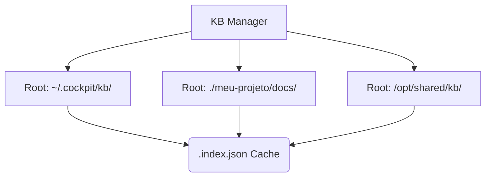

# 06. Base de Conhecimento (Knowledge Base)

> [!NOTE]
> **Fase de Desenvolvimento:** A arquitetura central do Knowledge Base, que compõe o módulo `internal/kb`, foi finalizada na **Fase 4**. Ela abrange multi-raízes, caching inteligente em disco e Busca em Grafo. Faltam pequenas integrações com Skills e Hooks.

O Knowledge Base (KB) no `AICockpit` não é apenas um repositório de Markdown. É um motor inteligente desenhado para injetar os metadados técnicos, manuais e guias diretamente no contexto da Inteligência Artificial. 

Ele atua como a Memória Longo-Prazo (LTM) do sistema e dos Agentes.

## 1. Arquitetura Multi-Raiz (Multi-Root)
O KB suporta múltiplas pastas raízes (configuradas em `config.yaml`). Isso significa que você pode ter um diretório de KB central (ex: `~/.cockpit/kb/`) misturado com arquivos do seu projeto local (ex: `./docs`).



## 2. A Estrutura do Documento e Metadados
Para que o KB compreenda o contexto, os documentos Markdown devem contar com um **YAML Frontmatter** padronizado.

Exemplo de Documento Suportado:
```markdown
---
title: "Como usar o Cockpit"
description: "Guia básico de comandos"
tags: ["cli", "basico"]
related: ["docs/outro-doc.md"]
---
# Meu Conteúdo
```
O `Manager` lê e valida o Frontmatter em tempo de carregamento usando o parser YAML e injeta as variáveis na estrutura da linguagem Go.

## 3. O Cache em Disco (`.index.json`)
Como a leitura recursiva de milhares de documentos e parses de YAML na inicialização seria lenta, o AICockpit gera um arquivo `.index.json`. 
A recriação do índice pode ser engatilhada manualmente via `cockpit kb rebuild-cache`. Ele é inteligente o bastante para observar a data de modificação (`mtime`) e apenas indexar o que for novo.

## 4. O Algoritmo de Busca: De Palavras-Chave a Grafos

A Busca no KB passou por uma evolução.
Hoje, o AICockpit mapeia um *Knowledge Graph* neural:
1. **Grafo Bidirecional:** O módulo `internal/kb/graph.go` varre a propriedade `related: []` de cada documento no índice. Ele cria *edges* (arestas) que ligam o documento A ao B, e o B ao A de volta.
2. **Busca BFS (Breadth-First Search):** Quando uma IA busca "quais os contextos relacionados ao `doc X`?", o algoritmo BFS é ativado na profundidade `N`.
3. **Escopo Expandido:** Isso permite que o pacote de compilação da IA (`ProviderManager`) puxe automaticamente toda a topologia de um assunto, garantindo um supercontexto inteligente e sem perdas durante as gerações de prompts.

---
> **Fim da Trilha Principal:** Com isto, fechamos o ciclo que vai desde a detecção da IA, formatação de arquivos com o Compilador Canônico, registro e instalação de Pacotes, Proteção no Cofre e Gerenciamento Inteligente de Conhecimento.
