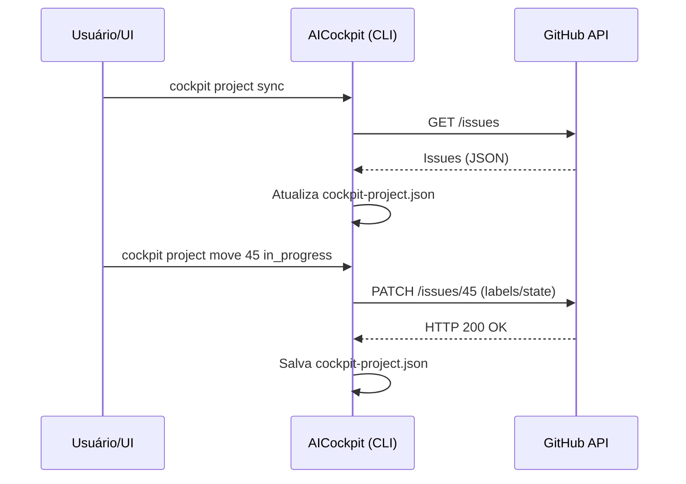

# 07. Project & Task Management

O sistema de gerenciamento de projetos do **AICockpit** (localizado em `internal/project` e invocado via `cmd/project.go`) é a espinha dorsal para coordenar fluxos de trabalho autônomos. Ele transforma o repositório local e as issues do GitHub em um **Quadro Kanban dinâmico**, permitindo que tanto desenvolvedores humanos quanto IAs colaborem de forma assíncrona.

## Arquitetura de Estado (State Machine)

Cada tarefa (task/issue) passa por uma máquina de estados estrita:
1. `todo` (A Fazer)
2. `in_progress` (Em Andamento)
3. `done` (Concluído)

A transição de estados altera o arquivo `cockpit-project.json` e notifica o provedor remoto (ex: GitHub).

## Sincronização Bidirecional com o GitHub

Para evitar que o AICockpit seja apenas mais uma ferramenta isolada de To-Do list, o `Project Manager` possui acoplamento bi-direcional com o GitHub:

## Resolução de Ordem de Tarefas (Sub-millisecond)

Em uma UI de Drag & Drop (como o Mini-App Cockpit Dashboard), as tarefas mudam de posição constantemente dentro de uma mesma coluna. 

Para resolver o problema de reordenação local de maneira eficiente e sem depender de metadados complexos do GitHub, o sistema de `ReorderTask` gera e atualiza **IDs com resolução de milissegundos** (ex: `<timestamp>-<issue_number>`).

Sempre que uma tarefa é movida, o array em memória é recriado (respeitando o novo índice de destino `newIndex`) e então salvo no estado local persistente. Isso garante consistência imediata na renderização da interface visual (Dashboard SvelteKit).

## Integração com Mini-Apps (Dashboard)

As funções em `internal/project` não servem apenas para a CLI. O pacote `cockpit-dashboard` (um mini-app FastAPI/SvelteKit no ecossistema) expõe essas chamadas localmente através do utilitário `cockpit-project.json`.

Ao mover um *card* no frontend Kanban:
1. O SvelteKit bate no Backend FastAPI.
2. O FastAPI lê/modifica o `cockpit-project.json` e aciona o binário CLI (`cockpit project sync`).
3. O Estado reflete perfeitamente na CLI, no Dashboard, e no GitHub.
